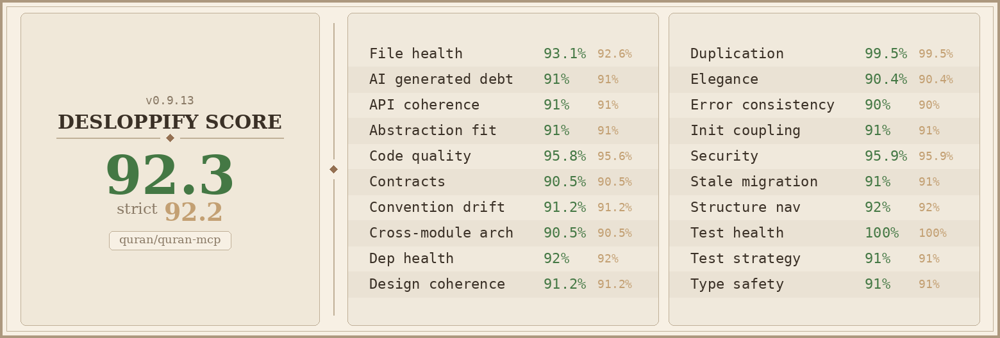

# quran-mcp

An MCP server providing canonical Quran text, translations, and tafsir commentary — sourced from [quran.com](https://quran.com).

## What this is

quran-mcp is a [Model Context Protocol](https://modelcontextprotocol.io/) server that gives AI assistants grounded access to the Quran. Instead of relying on training data (which can misquote, fabricate, or confuse verses), the AI fetches verified text through structured tool calls.

**Why this matters:** For Muslims, the Quran is the literal word of God. Misquoting it is not an acceptable error mode. This server exists so AI assistants can cite accurately, attribute properly, and defer to scholarly commentary rather than inventing interpretations.

## Capabilities

- **Quran text** — Arabic text in multiple qira'at (Hafs, Warsh, Qaloon, etc.)
- **Translations** — 50+ translations across 30+ languages
- **Tafsir** — Classical and modern exegesis from 15+ scholars (Ibn Kathir, al-Tabari, al-Qurtubi, al-Sa'di, and more)
- **Search** — Full-text search across Quran text, translations, and tafsir
- **Morphology** — Word-level grammatical analysis, root concordance, paradigm tables
- **Mushaf viewer** — Visual mushaf page rendering

## Quick start

### As a remote MCP server (recommended)

Add to your MCP client configuration:

```json
{
  "mcpServers": {
    "quran": {
      "url": "https://mcp.quran.ai",
      "type": "http"
    }
  }
}
```

Works with Claude Desktop, ChatGPT, and any MCP-compatible client.

### Self-hosted

```bash
git clone https://github.com/quran/quran-mcp.git
cd quran-mcp
cp .env.example .env        # fill in database password
docker compose up -d         # starts postgres + server
```

The server runs at `http://localhost:8088`.

For integration patterns beyond basic hosting, see [docs/SETUP.md](docs/SETUP.md). It documents both MCP-server composition (for sibling servers such as `quran-mcp-auth`) and client-style consumption (for apps such as `quran-mcp-admin`).

## Project structure

```
src/quran_mcp/
  server.py              Entry point
  mcp/                   Client-facing MCP surface
    tools/               fetch_quran, search_tafsir, etc.
    resources/           MCP resources
    prompts/             MCP prompts
  lib/                   Business logic and utilities
  middleware/            Request pipeline (rate limiting, grounding, logging)
  apps/                  Frontend apps (documentation site, mushaf viewer)
  assets/                Static files
tests/                   Test suite
codev/                   Development methodology (specs, plans, protocols)
```

## Development

```bash
uv venv && source .venv/bin/activate
uv pip install -e ".[dev]"
cp .env.example .env
docker compose up -d
pytest
```

## Data sources

All Quran text, translations, and tafsir are sourced from [Quran Foundation](https://quran.foundation) projects, including [quran.com](https://quran.com) and [nuqayah.com](https://nuqayah.com).

## License

[QFGPL-1.0](LICENSE.md) — Quran Foundation General Public License


