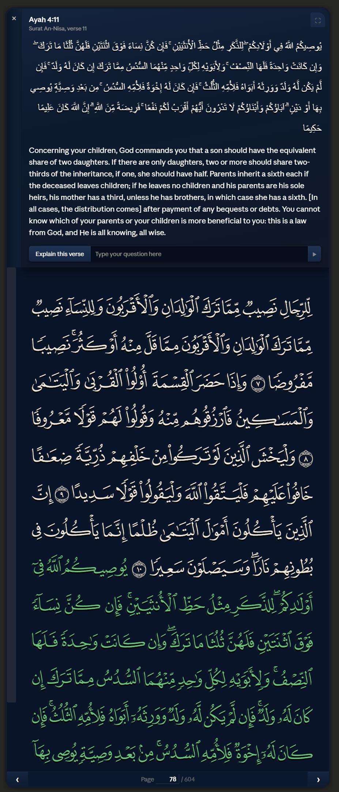

Al-Qurṭubī calls verse [4:11](https://quran.com/4/11) "a pillar among the pillars of the religion, and a foundation among the foundations of rulings" (رُكْنٌ مِنْ أَرْكَانِ الدِّينِ وَعُمْدَةٌ مِنْ عُمَدِ الأَحْكَامِ). He reports a hadith from Abu Hurayrah where the Prophet ﷺ said: "Learn the inheritance laws and teach them to people, for it is half of knowledge, and it is the first thing to be forgotten and the first thing to be taken away from my ummah." The entire Islamic inheritance framework is derived from three verses in Surah al-Nisāʾ — [4:11](https://quran.com/4/11), [4:12](https://quran.com/4/12), and [4:176](https://quran.com/4/176) — plus supporting hadith.

## The foundational principle

:::verse
ref: 4:7
link: https://quran.com/4/7
attribution: Sahih International

﴿لِّلرِّجَالِ نَصِيبٞ مِّمَّا تَرَكَ ٱلۡوَٰلِدَانِ وَٱلۡأَقۡرَبُونَ وَلِلنِّسَآءِ نَصِيبٞ مِّمَّا تَرَكَ ٱلۡوَٰلِدَانِ وَٱلۡأَقۡرَبُونَ مِمَّا قَلَّ مِنۡهُ أَوۡ كَثُرَۚ نَصِيبٗا مَّفۡرُوضٗا﴾
---
"For men is a share of what the parents and close relatives leave, and for women is a share of what the parents and close relatives leave, be it little or much - an obligatory share."
:::

This was a revolution against Jāhiliyyah practice. According to Ibn Kathir, the pre-Islamic Arabs gave inheritance only to males, excluding women entirely. Al-Qurṭubī adds that in the Jāhiliyyah, inheritance was determined by "manhood and strength" (الرُّجُولِيَّةِ والقُوَّةِ) — they would only give it to those who encountered wars and fought the enemy. Allah commands justice for both genders, making each share a divine obligation (*naṣīban mafrūḍā*).

:::artifact
ref: quran-inheritance-system-diagram.svg
caption: Overview of the Quranic inheritance share distribution
:::

## Children and parents — verse 4:11

:::verse
ref: 4:11
link: https://quran.com/4/11
attribution: Sahih International

﴿يُوصِيكُمُ ٱللَّهُ فِيٓ أَوۡلَٰدِكُمۡۖ لِلذَّكَرِ مِثۡلُ حَظِّ ٱلۡأُنثَيَيۡنِ فَإِن كُنَّ نِسَآءٗ فَوۡقَ ٱثۡنَتَيۡنِ فَلَهُنَّ ثُلُثَا مَا تَرَكَۖ وَإِن كَانَتۡ وَٰحِدَةٗ فَلَهَا ٱلنِّصۡفُۚ وَلِأَبَوَيۡهِ لِكُلِّ وَٰحِدٖ مِّنۡهُمَا ٱلسُّدُسُ مِمَّا تَرَكَ إِن كَانَ لَهُۥ وَلَدٞۚ فَإِن لَّمۡ يَكُن لَّهُۥ وَلَدٞ وَوَرِثَهُۥٓ أَبَوَاهُ فَلِأُمِّهِ ٱلثُّلُثُۚ فَإِن كَانَ لَهُۥٓ إِخۡوَةٞ فَلِأُمِّهِ ٱلسُّدُسُۚ مِنۢ بَعۡدِ وَصِيَّةٖ يُوصِي بِهَآ أَوۡ دَيۡنٍۗ ءَابَآؤُكُمۡ وَأَبۡنَآؤُكُمۡ لَا تَدۡرُونَ أَيُّهُمۡ أَقۡرَبُ لَكُمۡ نَفۡعٗاۚ فَرِيضَةٗ مِّنَ ٱللَّهِۗ إِنَّ ٱللَّهَ كَانَ عَلِيمًا حَكِيمٗا﴾
---
"Allāh instructs you concerning your children [i.e., their portions of inheritance]: for the male, what is equal to the share of two females. But if there are [only] daughters, two or more, for them is two thirds of one's estate. And if there is only one, for her is half. And for one's parents, to each one of them is a sixth of his estate if he left children. But if he had no children and the parents [alone] inherit from him, then for his mother is one third. And if he had brothers [and/or sisters], for his mother is a sixth, after any bequest he [may have] made or debt. Your parents or your children - you know not which of them are nearest to you in benefit. [These shares are] an obligation [imposed] by Allāh. Indeed, Allāh is ever Knowing and Wise."
:::

### Reason for revelation

:::quote
source: Tafsir Ibn Kathir (Abridged)
attribution: Ibn Kathir

Ibn Kathir records that the wife of Saʿd ibn al-Rabīʿ came to the Prophet ﷺ saying that Saʿd had been martyred at Uḥud and his brother had seized all the wealth, leaving nothing for his two daughters. The Prophet ﷺ said Allah would decide, and this verse was revealed. He then commanded the brother: "Give two-thirds to Saʿd's two daughters, one-eighth to their mother, and what remains is yours."
:::

:::quote
source: al-Jami' li-Ahkam al-Quran
attribution: Al-Qurtubi

Al-Qurṭubī also records an alternate narration: that the verse was revealed when Jābir ibn ʿAbdullāh fell ill and asked the Prophet ﷺ how to distribute his wealth. He cites further traditions attributing it to the case of Umm Kujja, to the daughters of ʿAbd al-Raḥmān ibn Thābit, and to the general Jāhiliyyah practice of disinheriting minors and women. He concludes: "It is not far-fetched that it was a response to all of them, and for that reason its revelation was delayed" (وَلَا يَبْعُدُ أَنْ يَكُونَ جَوَابًا لِلْجَمِيعِ).
:::

### Children's shares

The male child receives twice the share of the female. According to Ibn Kathir, this distinction exists because men bear financial obligations — spending on dependents, engaging in trade, and fulfilling marital duties (*nafaqah*). Al-Qurṭubī notes that the scholars unanimously agree (أَجْمَعَ العُلَمَاءُ) that when children inherit alongside someone with a fixed share (*farḍ*), the fixed-share holder is given theirs first, and what remains is divided among children with the male receiving twice the female's portion.

When there are only daughters: two or more receive ⅔ collectively, and a sole daughter gets ½. Al-Qurṭubī engages in an extended discussion of how the share of exactly two daughters was derived, since the Quran only explicitly names "two or more" (فَوْقَ ٱثْنَتَيْنِ). He cites the hadith of Saʿd ibn al-Rabīʿ as the strongest proof, alongside analogy from the sister-verse ([4:176](https://quran.com/4/176)), and rejects the claim that فَوْقَ is redundant — arguing that nothing in the Quran is useless.

### Parents' shares

Several forms emerge depending on the family situation:

**With surviving children**: Each parent gets ⅙. Both Ibn Kathir and al-Qurṭubī note this applies regardless of the child's gender.

**No children, only parents**: The mother gets ⅓, the father gets the remaining ⅔. Al-Qurṭubī explains the elegance of the Quranic phrasing: by saying "his parents inherit from him, then for his mother is the third," Allah implicitly assigned the father two-thirds without naming it — "as when you say to two men, 'this wealth is between you,' then tell one of them 'your share is a third,' you have by the force of your words given the other two-thirds."

**No children, but with siblings**: The mother's share drops from ⅓ to ⅙. Ibn Kathir explains that although the siblings themselves don't inherit in this scenario, their presence reduces the mother's share because the father bears the cost of helping them marry. Al-Qurṭubī adds that the scholars unanimously agree that two or more siblings — whether male, female, full, paternal, or maternal — effect this reduction.

:::insight
title: An interlocking mathematical structure of clean fractions

The Quranic system creates an interlocking mathematical structure where every share is a clean fraction (½, ⅓, ¼, ⅙, ⅛, ⅔). Al-Qurṭubī enumerates all six Quranic fractions and maps them to exactly which heirs receive each, producing a complete taxonomy of seventeen potential heirs (ten male, seven female). This precision reflects the verse's own conclusion: فَرِيضَةً مِّنَ ٱللَّهِ — "an obligation from Allah" — meaning these are not human approximations but divinely calibrated shares. The system's constraint that debts and bequests are deducted first means the fractions operate on a clean remainder, guaranteeing mathematical soundness.
:::

## Spouses and kalālah — verse 4:12

:::verse
ref: 4:12
link: https://quran.com/4/12
attribution: Sahih International

﴿وَلَكُمۡ نِصۡفُ مَا تَرَكَ أَزۡوَٰجُكُمۡ إِن لَّمۡ يَكُن لَّهُنَّ وَلَدٞۚ فَإِن كَانَ لَهُنَّ وَلَدٞ فَلَكُمُ ٱلرُّبُعُ مِمَّا تَرَكۡنَۚ مِنۢ بَعۡدِ وَصِيَّةٖ يُوصِينَ بِهَآ أَوۡ دَيۡنٖۚ وَلَهُنَّ ٱلرُّبُعُ مِمَّا تَرَكۡتُمۡ إِن لَّمۡ يَكُن لَّكُمۡ وَلَدٞۚ فَإِن كَانَ لَكُمۡ وَلَدٞ فَلَهُنَّ ٱلثُّمُنُ مِمَّا تَرَكۡتُمۖ مِنۢ بَعۡدِ وَصِيَّةٖ تُوصُونَ بِهَآ أَوۡ دَيۡنٖۗ وَإِن كَانَ رَجُلٞ يُورَثُ كَلَٰلَةً أَوِ ٱمۡرَأَةٞ وَلَهُۥٓ أَخٌ أَوۡ أُخۡتٞ فَلِكُلِّ وَٰحِدٖ مِّنۡهُمَا ٱلسُّدُسُۚ فَإِن كَانُوٓاْ أَكۡثَرَ مِن ذَٰلِكَ فَهُمۡ شُرَكَآءُ فِى ٱلثُّلُثِۚ مِنۢ بَعۡدِ وَصِيَّةٖ يُوصَىٰ بِهَآ أَوۡ دَيۡنٍ غَيۡرَ مُضَآرّٖۚ وَصِيَّةٗ مِّنَ ٱللَّهِۗ وَٱللَّهُ عَلِيمٌ حَلِيمٞ﴾
---
"And for you is half of what your wives leave if they have no child. But if they have a child, for you is one fourth of what they leave, after any bequest they [may have] made or debt. And for them [i.e., the wives] is one fourth if you leave no child. But if you leave a child, then for them is an eighth of what you leave, after any bequest you [may have] made or debt. And if a man or woman leaves neither ascendants nor descendants but has a brother or a sister, then for each one of them is a sixth. But if they are more than two, they share a third, after any bequest which was made or debt, as long as there is no detriment [caused]. [This is] an ordinance from Allāh, and Allāh is Knowing and Forbearing."
:::

### Spousal shares

:::quote
source: al-Jami' li-Ahkam al-Quran
attribution: Al-Qurtubi

Al-Qurṭubī notes the scholarly consensus: "They unanimously agreed that the ruling for one wife, two, three, or four is the same — they share in the quarter or the eighth — because Allah did not distinguish between the ruling for one wife and all of them, unlike how He distinguished between one daughter and multiple daughters."
:::

The husband gets ½ if his wife left no children, or ¼ if she did. The wife (or wives, sharing equally) gets ¼ if the husband had no children, or ⅛ if he did.

### The meaning of kalālah

:::quote
source: al-Jami' li-Ahkam al-Quran
attribution: Al-Qurtubi

Al-Qurṭubī provides an extensive etymology: kalālah derives from تَكَلَّلَهُ النَّسَبُ — "lineage encircled him" — like the iklīl (crown) that surrounds the head. It refers to one who dies leaving neither descendants nor ascendants. Abū Bakr al-Ṣiddīq defined it this way, and ʿUmar was reluctant to contradict him. The scholars agree unanimously that the siblings in [4:12](https://quran.com/4/12) are specifically maternal half-siblings.
:::

:::quote
source: Tafsir Ibn Kathir (Abridged)
attribution: Ibn Kathir

Ibn Kathir enumerates four distinctive features of maternal half-siblings: (1) they inherit through the mother, (2) males and females receive equal shares, (3) they only inherit in kalālah cases, and (4) their collective share never exceeds ⅓ regardless of their number.
:::

### The prohibition of harm (ghayra muḍārr)

The verse closes with the safeguard "so that no loss is caused." Al-Qurṭubī reports the hadith from Abū Hurayrah that the Prophet ﷺ said: "A man or woman may worship Allah obediently for sixty years, then death approaches and they cause harm in the bequest, thereby making the Fire obligatory for them." Harm includes bequeathing more than a third, bequeathing to an heir (prohibited by consensus), or falsely acknowledging a non-existent debt.

## Full and paternal siblings — verse 4:176

:::verse
ref: 4:176
link: https://quran.com/4/176
attribution: Sahih International

﴿يَسۡتَفۡتُونَكَ قُلِ ٱللَّهُ يُفۡتِيكُمۡ فِى ٱلۡكَلَٰلَةِۚ إِنِ ٱمۡرُؤٌاْ هَلَكَ لَيۡسَ لَهُۥ وَلَدٞ وَلَهُۥٓ أُخۡتٞ فَلَهَا نِصۡفُ مَا تَرَكَۚ وَهُوَ يَرِثُهَآ إِن لَّمۡ يَكُن لَّهَا وَلَدٞۚ فَإِن كَانَتَا ٱثۡنَتَيۡنِ فَلَهُمَا ٱلثُّلُثَانِ مِمَّا تَرَكَۚ وَإِن كَانُوٓاْ إِخۡوَةٗ رِّجَالٗا وَنِسَآءٗ فَلِلذَّكَرِ مِثۡلُ حَظِّ ٱلۡأُنثَيَيۡنِۗ يُبَيِّنُ ٱللَّهُ لَكُمۡ أَن تَضِلُّواْۗ وَٱللَّهُ بِكُلِّ شَيۡءٍ عَلِيمُۢ﴾
---
"They request from you a [legal] ruling. Say, 'Allāh gives you a ruling concerning one having neither descendants nor ascendants [as heirs].' If a man dies, leaving no child but [only] a sister, she will have half of what he left. And he inherits from her if she [dies and] has no child. But if there are two sisters [or more], they will have two thirds of what he left. If there are both brothers and sisters, the male will have the share of two females. Allāh makes clear to you [His law], lest you go astray. And Allāh is Knowing of all things."
:::

### The last verse revealed

:::quote
source: al-Jami' li-Ahkam al-Quran
attribution: Al-Qurtubi

According to al-Barāʾ ibn ʿĀzib in al-Bukhārī, this was the last verse of the Quran ever revealed. Al-Qurṭubī notes it was revealed while the Prophet ﷺ was preparing for the Farewell Pilgrimage. ʿUmar said: "There are three things — had the Messenger of Allah ﷺ clarified them, it would have been dearer to me than the world: the grandfather's share, the kalālah, and certain types of ribā." The Prophet ﷺ pointed to ʿUmar's chest and said: "The summer verse at the end of Sūrat al-Nisāʾ should suffice you."
:::

### Full and paternal siblings' shares

These follow the same ratios as children: one sister gets ½, two or more share ⅔, and when brothers and sisters coexist, the male gets twice the female's share.

:::quote
source: Tafsir Ibn Kathir (Abridged)
attribution: Ibn Kathir

Ibn Kathir records the pivotal hadith where Abū Mūsā al-Ashʿarī was asked about a case with a daughter, granddaughter, and sister. He ruled the daughter gets ½ and the sister gets ½. But Ibn Masʿūd corrected him: "I will give the judgment the Prophet ﷺ gave — the daughter gets ½, the granddaughter gets ⅙ to complete the two-thirds, and whatever remains is for the sister." Abū Mūsā then said: "Do not ask me for verdicts as long as this scholar is among you."
:::

## The deduction order

All shares are distributed **after** debts and bequests. Both Ibn Kathir and al-Qurṭubī note that the scholars unanimously agree: debts come first, then the will (*waṣiyyah*, capped at ⅓), then the fixed shares.

:::quote
source: al-Jami' li-Ahkam al-Quran
attribution: Al-Qurtubi

Al-Qurṭubī explains why the verse mentions bequests before debt even though debt has priority. He gives five scholarly explanations, the most compelling being: (1) the bequest is more common — every person can make one, but not everyone dies in debt; and (2) the bequest benefits the weak and poor (*masākīn* and *ḍuʿafāʾ*) who have no legal power to demand it, whereas the creditor has standing and authority to pursue their claim.
:::

The hadith states: "Allah has given each rightful heir their due — therefore there is no bequest for an inheritor" (إنَّ اللهَ قَدْ أَعْطَى كُلَّ ذِي حَقٍّ حَقَّهُ فَلَا وَصِيَّةَ لِوَارِثٍ).

## The six Quranic fractions

Al-Qurṭubī provides a complete taxonomy of all fractions from the Quran:

| Fraction | Heirs |
|----------|-------|
| **½** (al-niṣf) | Sole daughter, sole granddaughter, sole full sister, sole paternal sister, husband (no children) |
| **¼** (al-rubʿ) | Husband (with children), wife/wives (no children) |
| **⅛** (al-thumn) | Wife/wives (with children) |
| **⅔** (al-thuluthān) | 2+ daughters, 2+ granddaughters, 2+ full sisters, 2+ paternal sisters |
| **⅓** (al-thuluth) | Mother (no children, no 2+ siblings), 2+ maternal siblings |
| **⅙** (al-sudus) | Each parent (with children), grandmother(s), granddaughter with daughter, paternal sister with full sister, one maternal sibling |

:::insight
title: Three independent axes of inheritance in Islamic law

Al-Qurṭubī identifies three causes of inheritance in Islamic law: kinship (*nasab thābit*), marriage (*nikāḥ munʿaqid*), and patronage of emancipation (*walāʾ ʿatāqah*). These three can combine — a man might be his wife's husband, patron, and cousin simultaneously — and each channel operates independently. This triple-axis framework is uniquely Islamic; Roman and common law systems typically operate on a single kinship axis. The Quranic system's ability to stack inheritance claims across independent axes while maintaining clean fractional arithmetic is a remarkable feat of legal architecture.
:::

:::sources
- Sahih International (en-sahih-international)
- Ibn Kathir, *Tafsīr al-Qurʾān al-ʿAẓīm* (en-ibn-kathir)
- al-Qurṭubī, *al-Jāmiʿ li-Aḥkām al-Qurʾān* (ar-qurtubi)
:::

:::grounding
search_quran("inheritance shares parents children spouses", translations=en-sahih-international), fetch_translation(4:7, 4:11-12, 4:176, en-sahih-international), fetch_tafsir(4:11-12, 4:176, en-ibn-kathir), fetch_tafsir(4:11-12, 4:176, ar-qurtubi), show_mushaf(4:11)
:::
